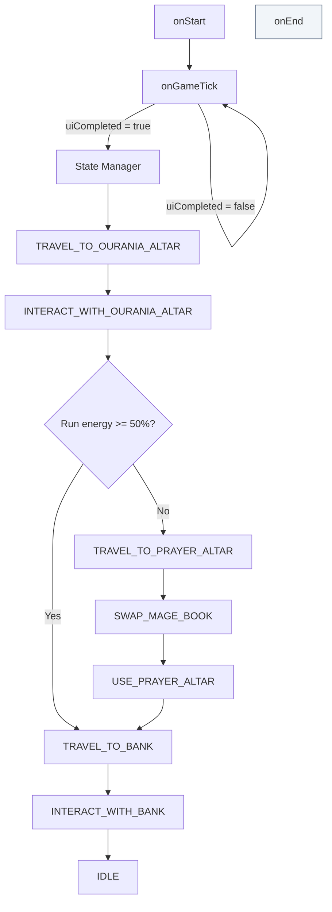
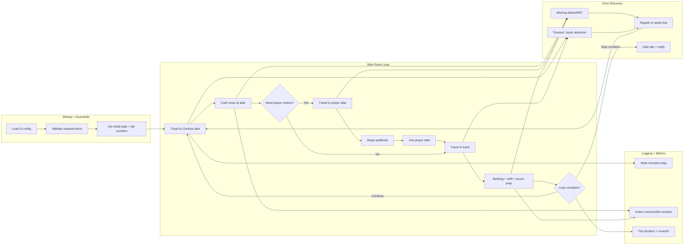

# profOuraniaAlter Script Blueprint

This document is the visual planning map for the full script lifecycle.
Use it to decide what to build next, branch ideas, and track what is done.

## 1) Current Main Flow (as coded today)

## 2) Expanded Build Blueprint (what to implement)

## 3) State-by-State Build Checklist

Mark each item with `[ ]` (todo), `[-]` (in progress), `[x]` (done).

### TRAVEL_TO_OURANIA_ALTAR
- [ ] Pathing strategy (static path / dynamic web path / tile checkpoints)
- [ ] Arrival detection (WorldArea + distance threshold)
- [ ] Failure handling if blocked/path fails

### INTERACT_WITH_OURANIA_ALTAR
- [ ] Confirm altar exists and is reachable
- [ ] Craft interaction timing and confirmation
- [ ] Pouch emptying logic before/after craft
- [ ] Decision gate for prayer detour vs direct bank

### TRAVEL_TO_PRAYER_ALTAR
- [ ] Find ladder and climb safely
- [ ] Position correction if misaligned plane/tile
- [ ] Retry strategy when ladder interaction fails

### SWAP_MAGE_BOOK
- [ ] Quest requirement check (Kingdom Divided varbit)
- [ ] Spellbook swap trigger + verify success
- [ ] Fallback if swap unavailable

### USE_PRAYER_ALTAR
- [ ] Confirm altar target + interaction
- [ ] Verify prayer restoration before leaving
- [ ] Timeout and retry thresholds

### TRAVEL_TO_BANK
- [ ] Movement route from altar area to bank area
- [ ] Run energy policy (toggle run, stamina handling)
- [ ] Anti-stuck correction points

### INTERACT_WITH_BANK
- [ ] Open bank and validate interface
- [ ] Deposit/withdraw rules
- [ ] Pouch fill strategy
- [ ] Inventory sanity check before next loop

### IDLE
- [ ] Exit criteria or resume trigger
- [ ] Optional auto-restart loop setting

## 4) Branching Board (idea sandbox)

Use this section to plan alternative strategies without disrupting the main design.

### Branch A: Fast XP Route
- Goal:
- Tradeoff:
- States affected:
- New conditions:
- Risks:
- Test plan:

### Branch B: Safe/Stable Route
- Goal:
- Tradeoff:
- States affected:
- New conditions:
- Risks:
- Test plan:

### Branch C: High-AFK Route
- Goal:
- Tradeoff:
- States affected:
- New conditions:
- Risks:
- Test plan:

## 5) Transition Rules (single source of truth)

Keep this in sync with code so flow changes are intentional.

| From State | Condition | To State | Notes |
|---|---|---|---|
| TRAVEL_TO_OURANIA_ALTAR | Arrival complete | INTERACT_WITH_OURANIA_ALTAR | Currently direct |
| INTERACT_WITH_OURANIA_ALTAR | Run energy >= 50% | TRAVEL_TO_BANK | Threshold in constants |
| INTERACT_WITH_OURANIA_ALTAR | Run energy < 50% | TRAVEL_TO_PRAYER_ALTAR | Prayer detour |
| TRAVEL_TO_PRAYER_ALTAR | Ladder traversal complete | SWAP_MAGE_BOOK | Currently direct |
| SWAP_MAGE_BOOK | Spellbook swap complete | USE_PRAYER_ALTAR | Currently direct |
| USE_PRAYER_ALTAR | Prayer restore complete | TRAVEL_TO_BANK | Currently direct |
| TRAVEL_TO_BANK | Arrival complete | INTERACT_WITH_BANK | Currently direct |
| INTERACT_WITH_BANK | Banking complete | IDLE | Placeholder end state |

## 6) Suggested Next Build Order

1. Finish `INTERACT_WITH_BANK` inventory + pouch logic.
2. Implement robust movement in `TRAVEL_TO_BANK` and `TRAVEL_TO_OURANIA_ALTAR`.
3. Add success/failure confirmation checks in altar interactions.
4. Implement `IDLE` behavior (loop resume, stop, or fail-safe).
5. Add recovery policies (timeouts, stuck detection, repath).

## 7) Quick Editing Tips

- Keep diagrams in Mermaid for easy Git diffs and quick edits.
- Add a new branch by copying one block in Section 4.
- When adding a new state in code, update:
  - state enum
  - state manager switch
  - transition table in this file
- If your loop logic changes, update Section 1 first so this stays trustworthy.
